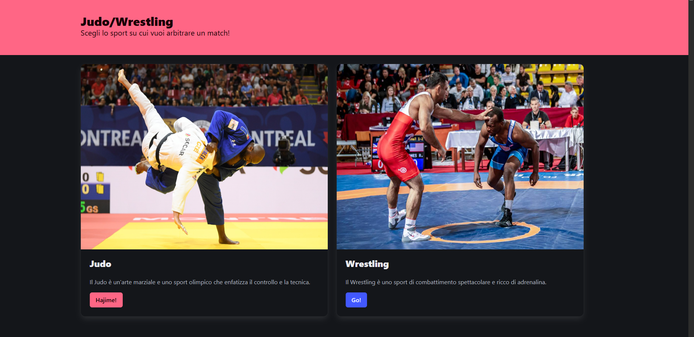
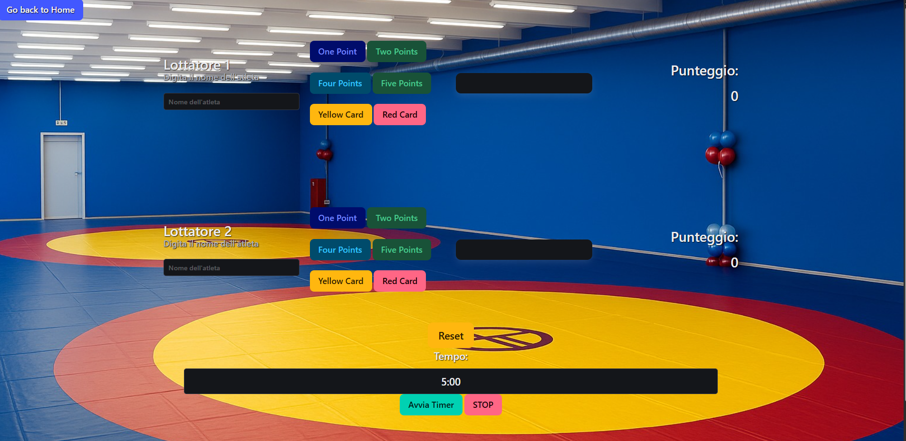
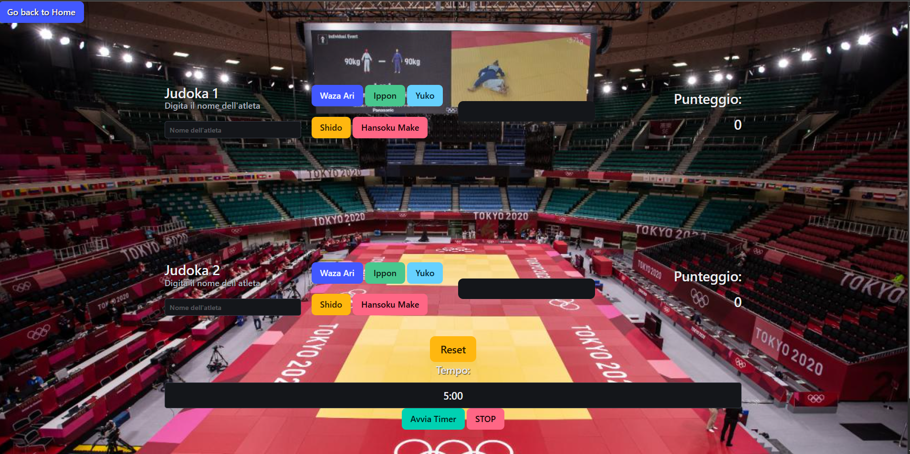

# JudoLottaJS

Un'applicazione web interattiva per gestire e arbitrare match di Judo e Wrestling. Questo progetto utilizza **HTML**, **CSS** (con il framework **Bulma**) e **JavaScript** per creare un'interfaccia utente dinamica e coinvolgente.

## Funzionalità

- **Homepage**:
  - Selezione tra Judo e Wrestling con immagini rappresentative.
  - Pulsanti per navigare verso le pagine dedicate a ciascuno sport.

- **Pagina Wrestling**:
  - Gestione dei punteggi per due lottatori.
  - Assegnazione di punti (1, 2, 4, 5) e penalità (cartellini gialli e rossi).
  - Visualizzazione dinamica del punteggio e delle penalità.
  - Timer per il match con pulsanti di avvio e reset.

- **Pagina Judo**:
  - Funzionalità simili alla pagina Wrestling, adattate alle regole del Judo.

## Tecnologie Utilizzate

- **HTML5**: Struttura delle pagine.
- **CSS3**: Stile e layout (con il framework **Bulma**).
- **JavaScript**: Logica interattiva per la gestione dei punteggi e delle penalità.

## Come Utilizzare

1. Clona il repository o accedi al seguente link https://fralog4.github.io/Judo-Wrestling-Score-Board/.
2. Assicurati che tutte le immagini siano nella cartella `assets/images`.
3. Apri `index.html` in un browser per accedere alla homepage.
4. Naviga verso le pagine dedicate a Judo o Wrestling per iniziare a gestire i match.

## Screenshot

### Pagina Wrestling

### Pagina Judo

## To-Do

- Aggiungere un sistema di salvataggio dei risultati.
- Migliorare il design e l'accessibilità.

## Contributi

Contributi, segnalazioni di bug e suggerimenti sono benvenuti! Sentiti libero di aprire una **issue** o inviare una **pull request**.